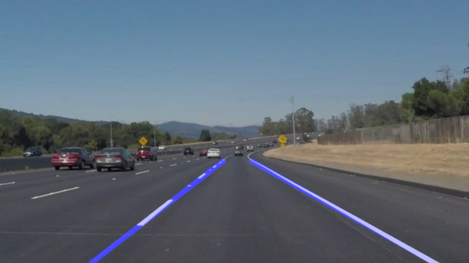
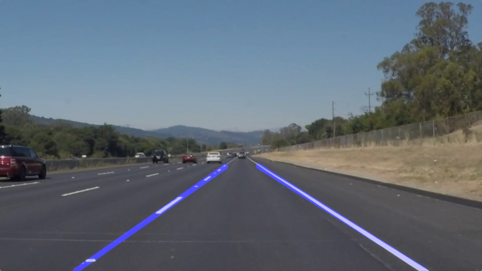
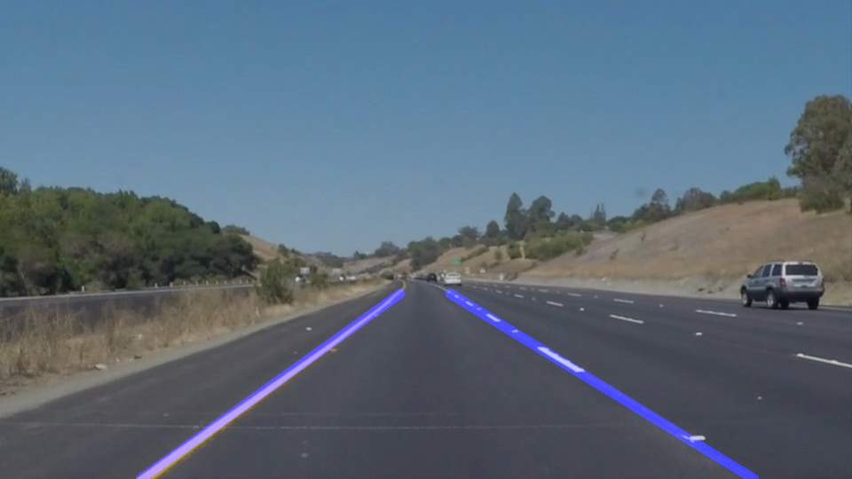
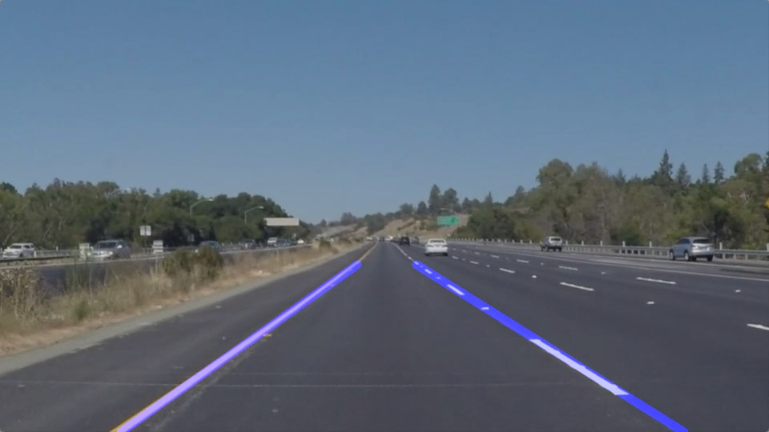

#**Finding Lane Lines on the Road** 

### For indentifying the lanes I use the following:
    * A gaussian kernel to filter the image
    * A canny edge detector
    * Hough transformation to find lines from the edges

    
    
### For connecting the lanes:
    * Divide all lines into two, based on negative or positive slope 
    * Ignore lines with slope in range (-0.5, 0.5)
    * Iterate over the two sets of line to find start and stop coordinates of the lane
    * Use average slope to extrapolate the lines.

### Further changes that can be done
    * Update hough transform parameters
    * Callibrate region of interest more properly
    * Add smoothing window by using history of previous frames
    * Use numpy arrays and collections to improve processing speeds

Sample Output (Image) - 

